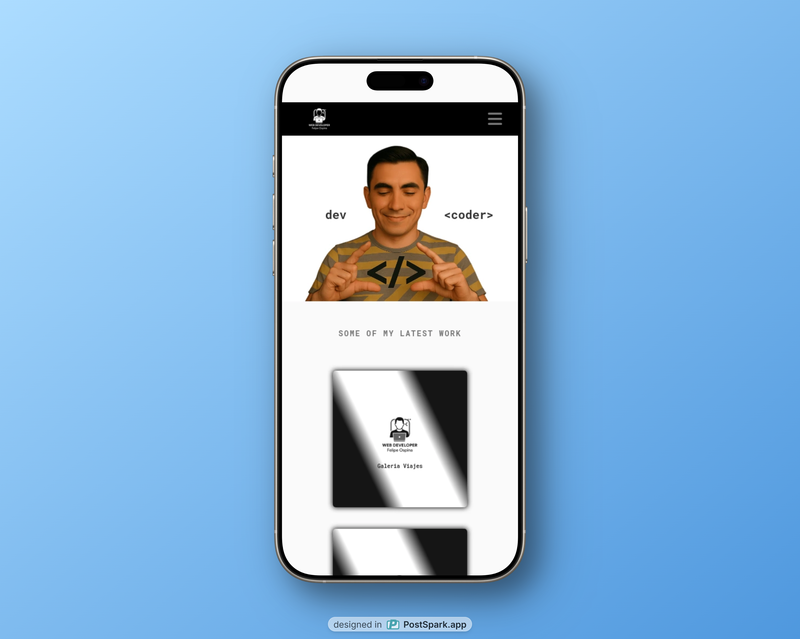
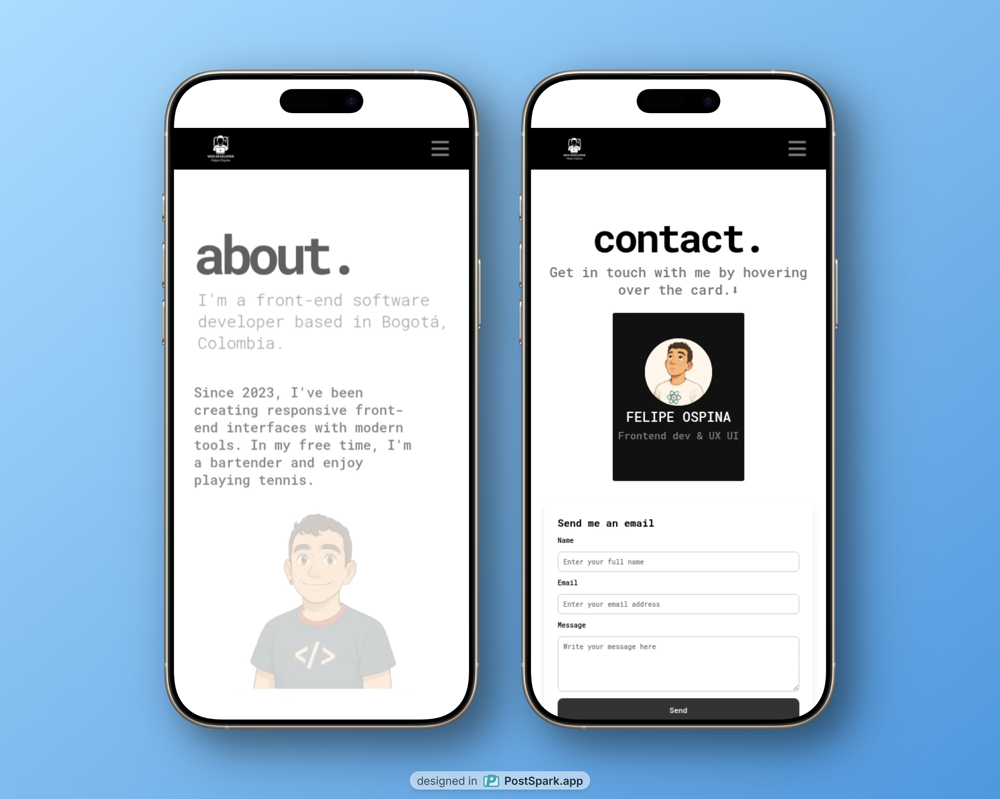
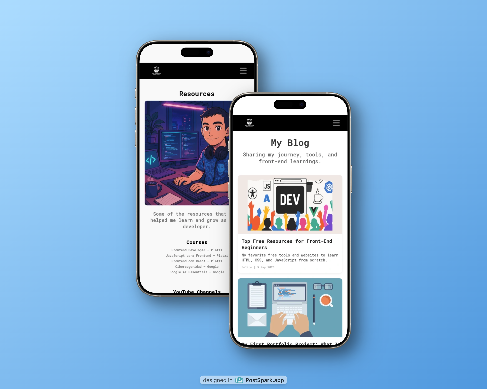

# 🌐 Portafolio Web - Andres Felipe Cubillos Ospina🎵

¡Bienvenido a mi portafolio interactivo!  
Aquí comparto los proyectos más representativos que he desarrollado como **Frontend Developer**, fusionando creatividad, rendimiento y buenas prácticas de desarrollo web.

Explora una interfaz moderna, animada y responsive que refleja mis habilidades tanto técnicas como visuales.  
Además del desarrollo, también incluyo una sección sobre mi experiencia como bartender profesional.

## Capturas de Pantalla 📷📷

- Página principal.

- Sección About me y contacto

- Sección Blog y recursos

## 🚀 Características

- Navegación clara y organizada por secciones.
- Diseño responsive para todo tipo de pantallas.
- Animaciones suaves con AOS (Animate On Scroll).
- Integración de iconos con FontAwesome.
- Proyectos interactivos con enlaces a demos y repositorios.
- Sección “Random Facts” con un toque personal y auténtico.

## 🛠 Tecnologías Utilizadas

- **HTML5**
- **CSS3**
- **JavaScript** (Vanilla y React)
- **Figma** para prototipos y diseño UI
- **AOS.js** para animaciones en scroll

### 🧠 Inspiración

Este portafolio fue **inspirado y adaptado** a partir del increíble diseño de portafolio de  
[© Adham Dannaway](https://www.adhamdannaway.com/) — un referente en diseño de interfaces limpias y profesionales.

> Todo el código, contenido y personalización fueron creados por mí, pero reconozco y agradezco la inspiración visual del trabajo original de [Adham Dannaway](https://www.adhamdannaway.com/).

## Licencia

Este proyecto está bajo la Licencia MIT. Consulta el archivo [LICENSE](LICENSE) para más detalles.

